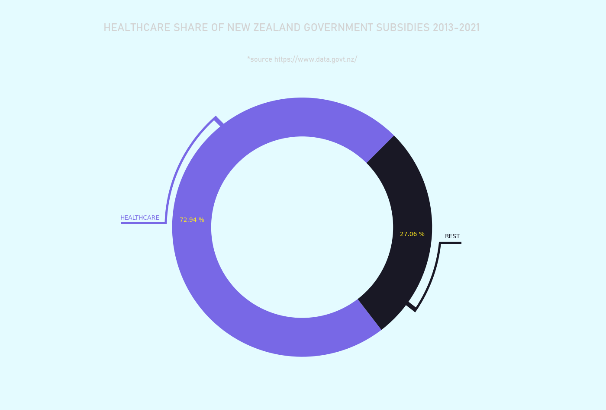
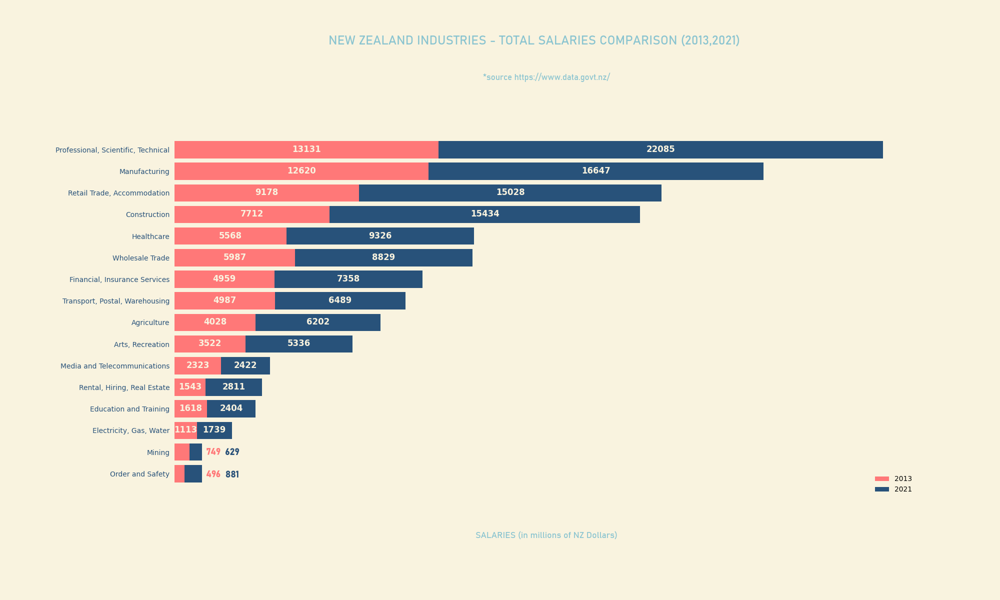
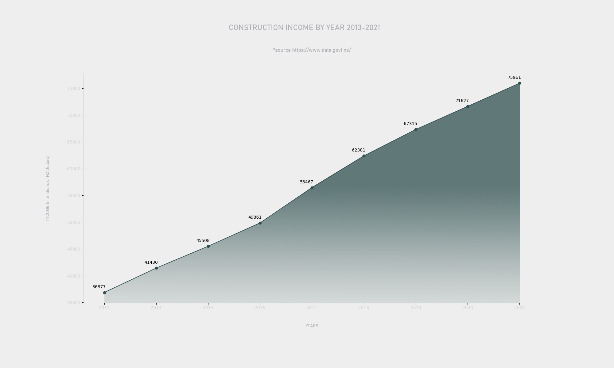
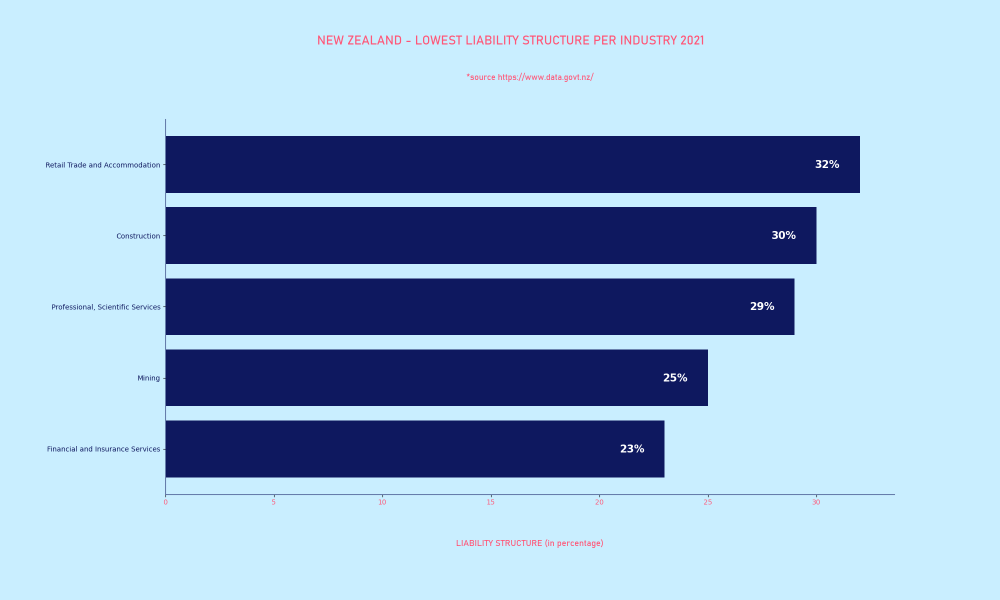

<strong>ABOUT</strong> 
 

Analyzing New Zealand government data with Python, Pandas and MatplotLib. The data covers a nine year period from 2013-2021. At the moment, analysis includes government subsidies but will grow as time goes by. The code is divided into packages to make navigation easier. 

The data sheet picked up from https://www.data.govt.nz/

Due to the size of this project, the analysis covers trends in major industries. This means I did not explore trends of rental, hiring and real estate separately but as part of what NZ government labeled as 'Rental, Hiring and Real Estate Services' (a major industry branch). To be fair to this datasheet, you can do that if you want to focus on something in particular.

In addition to Matplotlib, I added a few touches to my charts in Photoshop to make them more interesting. Granted,
a few of these details may have been added with Matplotlib but I have felt that the PS had given me more tools to achieve the results I was after. 

<strong>HOW TO NAVIGATE THIS REPO?</strong> 

In short, there are a lot of packages, modules, and imports 
 
There's a main data package named 'gov_data' and all other packages import from module 'data.py' that is inside of that package. 
  
The other major packages are named after the subject they explore (for ex. 'government_subsidies', 'income') and contain modules that deal with and make charts only for that type of data. Inside of the major packages there's the chart subpackage that imports from main modules to create charts.

<strong>TESTS</strong> 

In government subsidies package you'll find a sample unittest module that tests for functions in gov_subsidies_2013_2021.py. Similar functions can be found across this project so I didn't post tests for them. 

<strong>GOVERNMENT SUBSIDIES</strong> 

Lots of interesting findings in this section that contains 6 charts dissecting New Zealand government subsidies to the major industries. Healthcare subsidies are dominating but declined in the last few years, while Construction and Retail subsidies have skyrocketed. Construction subsidies have grown 854 times in nine years that this data covers. Retail have managed a whopping 229 times increase and cracked the top 5 recipients of the subsidies. 

<strong>INCOME</strong> 

Construction and Rental/Real Estate recorded highest growth in income over this nine year period, and that growth is recorded in separate charts. In addition, this section features industries that recorded highest total income as well as highest average income per employee. You won't find too many surprises here and to sum it up - work in finances not in arts.

<strong>EXPENDITURES, SALARIES AND TAXES</strong> 

I put these three together and the usual suspects - Construction pops up in two of the three categories. Both Construction expenditures and salaries have doubled from 2013 to 2021. That kind of increase is unmatched by any of the other major industries in New Zealand. When it comes to indirect taxes, Manufacturing have paid more indirect taxes than all the industries combined in the nine year period from 2013-2021. Manufacturing share of total indirect taxes paid clocks in slightly above 51 percent. In the same period Rental, Hiring and Real Estate Services indirect taxes increased for more than 61 percent, the highest among all major industries.    

<strong>LIABILITIES, EQUITIES AND ASSETS</strong> 

It is not a surprise that Finance industry holds the majority (over 55%) of assets in NZ but a sudden drop off of the mining assets in 2018 looks interesting to say the least. Both Finance industry and Mining look the healthiest in 2021 liability structure report, while construction has topped the return on equity comparison between 2013 and 2021.

<strong>NOTES</strong> 
 
All charts are in the assets folder

<strong>SCREENSHOTS</strong>

