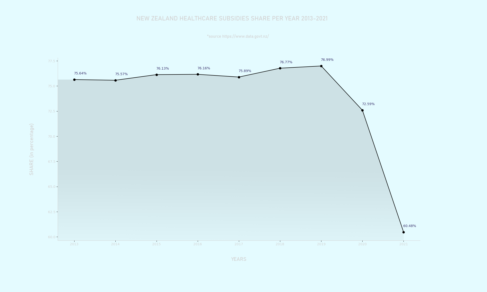

*THIS REPO WILL RECEIVE FURTHER UPDATES!

<strong>ABOUT</strong> 
 

Analyzing New Zealand government data with Python, Pandas and MatplotLib. The data covers a nine year period from 2013-2021. At the moment, analysis includes government subsidies but will grow as time goes by. The code is divided into packages to make navigation easier. 

The data sheet picked up from https://www.data.govt.nz/

Due to the size of this project, the analysis covers trends in major industries. This means I did not explore trends of rental, hiring and real estate separately but as part of what NZ government labeled as 'Rental, Hiring and Real Estate Services' (a major industry branch). To be fair to this datasheet, you can do that if you want to focus on something in particular.

In addition to Matplotlib, I added a few touches to my charts in Photoshop to make them more interesting. Granted,
a few of these details may have been added with Matplotlib but I have felt that the PS had given me more tools to achieve the results I was after. 

<strong>GOVERNMENT SUBSIDIES</strong> 

Lots of interesting findings in this section that contains 6 charts dissecting New Zealand government subsidies to the major industries. Healthcare subsidies are dominating but declined in the last few years, while construction and retail subsidies have skyrocketed. Construction subsidies have grown 854 times in nine years that this data covers. Retail have managed a whopping 229 times increase and cracked the top 5 recipients of the subsidies. 

<strong>HOW TO NAVIGATE THIS REPO?</strong>
In short, there are a lot of packages, modules, and imports 
 
There's a main data package named 'gov_data' and all other packages import from module 'data.py' that is inside of that package. 
  
The other major packages are named after the subject they explore (for ex. 'government_subsidies', 'income') and contain modules that deal with and make charts only for that type of data. Inside of the major packages there's the chart subpackage that imports from main modules to create charts.

<strong>NOTES</strong> 
 
All charts are in the assets folder. Screenshots will show only some.

<strong>SCREENSHOTS</strong>

